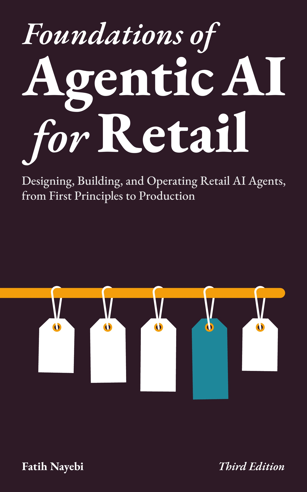

# Foundations of Agentic AI for Retail (Third Edition Companion Code)

A modular, extensible Python framework and companion codebase for the third edition of *Foundations of Agentic AI for Retail*. It includes agent architectures, coordination protocols, production guardrails, evaluation packs, and end-to-end demos that map to the book's operating model and capstone workflow.

## Featured Book: Foundations of Agentic AI for Retail, Third Edition

<table>
  <tr>
    <td width="60%">
      <a href="https://github.com/gradient-divergence/agentic-retail-foundations"><strong>Foundations of Agentic AI for Retail: Designing, Building, and Operating Retail AI Agents, from First Principles to Production (Third Edition)</strong></a> by Fatih Nayebi.
      <br><br>
      <em>Retail is the most demanding proving ground for agentic AI: thin margins, live inventory, real customers, and constant change. This edition focuses on production-ready operating models, evaluation, and governance.</em>
      <br><br>
      The third edition (October 2026) is being prepared for Amazon in paperback, hardcover and Kindle. <strong>The earlier edition on Amazon:</strong> <a href="https://www.amazon.com/Foundations-Agentic-Retail-Technologies-Architectures/dp/1069422606">US</a> | <a href="https://www.amazon.ca/Foundations-Agentic-Retail-Technologies-Architectures/dp/1069422606">CA</a> | <a href="https://www.amazon.co.jp/Foundations-Agentic-Retail-Technologies-Architectures/dp/1069422606">JP</a> | <a href="https://www.amazon.co.uk/Foundations-Agentic-Retail-Technologies-Architectures/dp/1069422606">UK</a> | <a href="https://www.amazon.de/Foundations-Agentic-Retail-Technologies-Architectures/dp/1069422606">DE</a> | <a href="https://www.amazon.fr/Foundations-Agentic-Retail-Technologies-Architectures/dp/1069422606">FR</a> | <a href="https://www.amazon.in/Foundations-Agentic-Retail-Technologies-Architectures/dp/1069422606">IN</a> | <a href="https://www.amazon.it/Foundations-Agentic-Retail-Technologies-Architectures/dp/1069422606">IT</a> | <a href="https://www.amazon.es/Foundations-Agentic-Retail-Technologies-Architectures/dp/1069422606">ES</a>
      <br>
    </td>
    <td width="40%" align="center" valign="center">
      <a href="https://www.amazon.com/Foundations-Agentic-Retail-Technologies-Architectures/dp/1069422606">
        
      </a>
    </td>
  </tr>
</table>

## What's New in the Third Edition

- **Repaired code.** The demos, agents and utilities were repaired for this edition, and the book's printed listings are drawn from this code.
- **Regression tests.** Each repair came with a test; the suite grew from 36 test files to 106.
- **Demos that say what they need.** A demo that needs an API key or a running service now names it and stops, instead of failing midway.
- **Tags.** `third-edition` marks the code as printed in the third edition; `v2.0.0` is the second edition's.

## What the Second Edition Added

- **Retail Agent Operating Model (RAOM)** as the narrative spine across chapters and code.
- **Capstone workflow** that accumulates across chapters (inventory risk → supplier outreach → price protection → customer messaging → audit trail).
- **Three-plane architecture**: capability, control, and integration planes for system design.
- **Contract-first schemas** with runnable companion code and drift controls.
- **Evaluation pyramid + red-team packs** for safety, regression control, and release readiness.
- **Agent learning ladder**: prompt/tool tuning → SFT/PEFT → DPO/GRPO → RLHF/RLAIF → RFT.
- **Interoperability & standards**: MCP, agent-to-agent messaging, and emerging commerce protocols (ACP, AP2).
- **Context engineering** as a first-class design discipline (memory, retention boundaries, policies).
- **Expanded SOTA coverage**: offline RL, constrained RL, conformal prediction, GNNs, Mamba/SSM.
- **Teaching assets**: case packets, notation guide, glossary, and companion resources.

## Table of Contents

- [What's New in the Third Edition](#whats-new-in-the-third-edition)
- [What the Second Edition Added](#what-the-second-edition-added)
- [Companion Code Highlights](#companion-code-highlights)
- [Directory Structure](#directory-structure)
- [Setup Instructions](#setup-instructions)
- [Usage](#usage)
- [Development Best Practices](#development-best-practices)
- [Contribution Guidelines](#contribution-guidelines)
- [Documentation Website](#documentation-website)
- [GitHub Repository](#github-repository)

## Companion Code Highlights

*   **Retail Agent Operating Model (RAOM):** Minimal RAOM implementation and examples (`agents/raom_minimal.py`).
*   **Capstone Workflow:** End-to-end orchestration scaffolding with schemas, policies, tools, and tracing (`capstone/`).
*   **Agent Architectures:** BDI, OODA, Q-learning, Bayesian, causal, and LLM-based agents (`agents/`).
*   **Coordination Protocols:** Contract Net, auctions, and inventory sharing (`agents/protocols/`).
*   **Interoperability & Standards:** MCP tooling contracts and commerce protocols (ACP/AP2) via demos and manifests (`demos/`).
*   **Evaluation & Red Teaming:** Scenario packs and scoring rubrics (`evals/`, `redteam/`).
*   **Retail Data Models:** Pydantic models for core retail concepts (`models/`).
*   **Utilities & Observability:** Monitoring, event bus, planning, CRDTs, and NLP helpers (`utils/`).
*   **Notebooks & Demos:** Marimo notebooks and runnable demos aligned to the book (`notebooks/`, `demos/`).
*   **Testing & Tooling:** Pytest suite, Ruff, MyPy, and Makefile automation (`tests/`, `Makefile`).

## Directory Structure

```
agentic-retail-foundations/
├── agents/               # Core agent logic, protocols, and specific agent types
│   ├── coordinators/     # Coordinator agent implementations
│   ├── cross_functional/ # Agents spanning multiple business functions
│   ├── protocols/        # Coordination protocols (CNP, Auction, Inventory Sharing)
│   └── ...
├── assets/               # Diagrams and static assets (book cover, figures)
├── capstone/             # End-to-end capstone workflow scaffolding
├── config/               # Configuration helpers
├── connectors/           # Interfaces to external systems (mocked connectors)
├── demos/                # Standalone demo scripts and protocol examples
├── docs/                 # MkDocs documentation source files
├── environments/         # Simulation environments (e.g., MDP for RL)
├── evals/                # Evaluation scenarios and scoring rubrics
├── models/               # Pydantic data models for retail concepts
├── notebooks/            # Marimo notebooks for exploration and visualization
├── redteam/              # Red-team scenarios for safety testing
├── tests/                # Unit and integration tests (pytest)
├── utils/                # Utilities (monitoring, planning, NLP, event bus, etc.)
├── .env.example          # Example environment variables template
├── .gitignore
├── .pre-commit-config.yaml
├── LICENSE
├── Makefile
├── mkdocs.yml
├── pyproject.toml
└── README.md
```

## Setup Instructions

1.  **Prerequisites:**
    *   Git
    *   Python 3.10+
    *   `uv` (recommended for fast environment/package management)

2.  **Clone the repository:**
    ```sh
    git clone https://github.com/gradient-divergence/agentic-retail-foundations.git
    cd agentic-retail-foundations
    ```

3.  **Install `uv` (if not already installed):**
    Follow the official instructions: https://github.com/astral-sh/uv

4.  **Create Virtual Environment & Install Dependencies:**
    ```sh
    make install
    # or: make venv
    ```

5.  **Activate the Virtual Environment:**
    ```sh
    source .venv/bin/activate
    ```
    Alternatively, use `make shell` to start a sub-shell with the environment activated.

6.  **Set up Environment Variables:**
    *   Copy the example environment file:
        ```sh
        cp .env.example .env
        ```
    *   Edit `.env` and add your necessary API keys or configuration secrets (e.g., `OPENAI_API_KEY`).
    *   **Important:** `.env` is listed in `.gitignore` and should **never** be committed.

7.  **Optional: OpenAI Agents SDK demos**
    *   Install the SDK dependencies:
        ```sh
        pip install --upgrade openai openai-agents python-dotenv
        ```
    *   SDK-specific demos (for example, `demos/*_agents_sdk_demo.py`) import the SDK via
        `demos/openai_agents_sdk_import.py` to avoid collisions with this repo's local
        `agents/` package.

8.  **Optional: Protocol SDKs and reference implementations**
    *   Install protocol SDK dependencies:
        ```sh
        uv pip install -e ".[agent_protocols]"
        ```
    *   ACP is treated as a spec-only protocol reference (no SDK dependency).
    *   Other optional stacks have named extras: `streaming` (Redis/Kafka), `spark`,
        `gnn`, `monitoring` (Prometheus), `cloud` (Postgres/Supabase), `auth`, and `explainability` (SHAP).
        Install one with `uv sync --extra <name>`; use `uv sync --all-extras` for the complete test environment.

9.  **Install Pre-commit Hooks (Recommended):**
    ```sh
    make precommit
    # or: pre-commit install
    ```

## Usage

Common development tasks are streamlined using the `Makefile`. Ensure your virtual environment is active (`source .venv/bin/activate` or `make shell`) when running Python scripts or tools like `marimo` directly.

*   **Run Marimo Notebooks:**
    ```sh
    marimo edit notebooks/<notebook_name>.py
    # e.g., marimo edit notebooks/multi-agent-systems-in-retail.py
    ```
    Use `marimo run ...` for a read-only view.

*   **Run Demo Scripts:**
    ```sh
    python demos/<demo_name>.py
    # e.g., python demos/task_allocation_cnp_demo.py
    ```

*   **Run Linters / Formatters / Type Checks:**
    ```sh
    make lint          # Run Ruff linter
    make format        # Run Ruff formatter
    make format-check  # Check formatting without making changes (for CI)
    make type-check    # Run MyPy static type checker
    ```

*   **Run Tests:**
    ```sh
    make test          # Run offline pytest tests with the existing .venv
    make test PYTHON=/path/to/python  # Use an existing interpreter; installs nothing
    make check         # Run Ruff on packages/tests, then offline tests
    make coverage      # Run tests and generate coverage report
    make ci            # Run format-check, type-check, tests, coverage, docs build
    ```

*   **Build / Serve Documentation:**
    ```sh
    make docs-build    # Build MkDocs site (outputs to site/)
    make docs-serve    # Serve docs locally with live reload (http://127.0.0.1:8000)
    ```

*   **Manage Environment:**
    ```sh
    make shell         # Start a new shell with venv activated
    make clean         # Remove cache files (__pycache__), build artifacts
    make clean-venv    # Remove the .venv directory entirely
    make venv          # Recreate the virtual environment (if deleted)
    make install       # Sync dependencies into the existing venv
    ```

*   **List All Commands:**
    ```sh
    make help
    ```

## Development Best Practices

*   **Modularity:** Keep agent logic, data models, utilities, and connectors in their respective directories.
*   **Configuration:** Use environment variables (`.env` file loaded via `python-dotenv`) for secrets and environment-specific settings.
*   **Typing:** Use Python type hints extensively. Run `make type-check` (`mypy`) regularly.
*   **Linting & Formatting:** Adhere to styles enforced by `ruff`. Run `make format` and `make lint` frequently.
*   **Testing:** Write unit tests (`pytest`) for individual functions/classes and integration tests for components working together.
    `make test` and `make check` use installed tools and never create an environment or install packages.
    Full-suite tests require the locked extras (`uv sync --all-extras`); provider calls use fake clients.
    Coroutine tests with synchronous fixtures can run offline using `asyncio.run` when `pytest-asyncio` is absent.
    Coverage is opt-in (`make coverage`, requires `pytest-cov`); normal tests use the installed runtime dependencies.
*   **Documentation:** Maintain docs in `docs/` and keep this README in sync with the book and code.

## Contribution Guidelines

Please refer to [`CONTRIBUTING.md`](CONTRIBUTING.md) for details on how to contribute to this project.

## Documentation Website

The MkDocs site is published at: https://gradient-divergence.github.io/agentic-retail-foundations

You can also build and serve the documentation locally using `make docs-serve`.

## GitHub Repository

*   Main repository: https://github.com/gradient-divergence/agentic-retail-foundations
